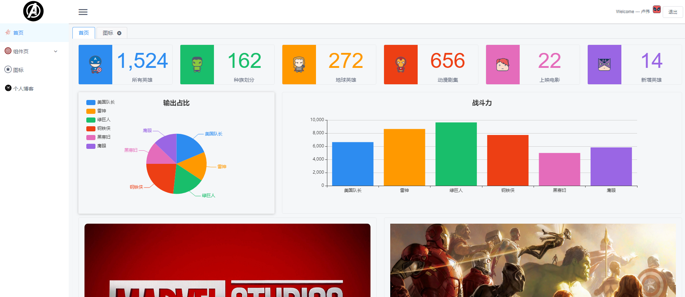
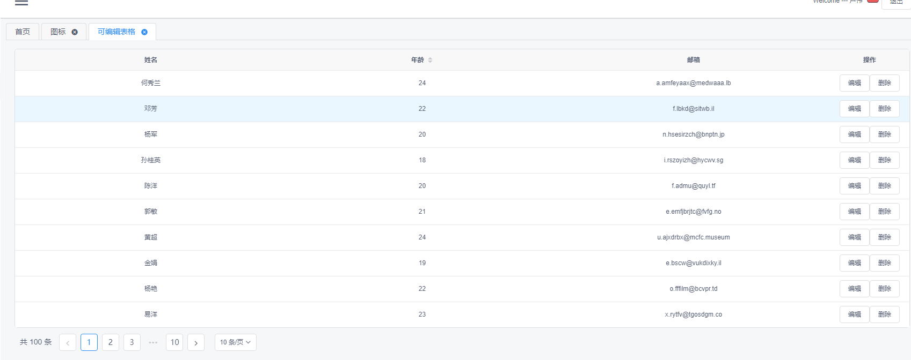
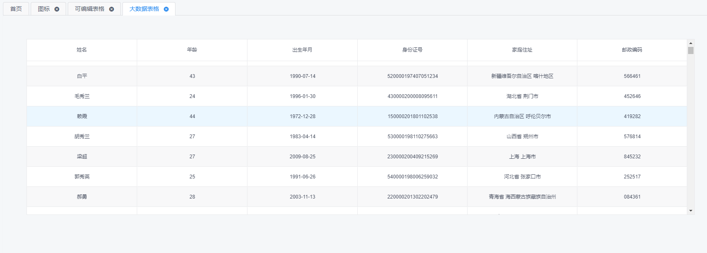

# zh_admin

## Project setup
```
yarn install
```

### Compiles and hot-reloads for development
```
yarn run serve
```

### Compiles and minifies for production
```
yarn run build
```

### Run your tests
```
yarn run test
```

### Lints and fixes files
```
yarn run lint
```
### 项目概述
- vue-cli 构建
- vue ~2.6.10, vuex ~3.0.1, vue-router ~3.0.3
- iview UI框架
- less 预处理器
- mockjs模拟数据
- echarts 图表，第三方虚拟表格渲染10w+数据
### 项目图例
1. login-page

2. home-page

3. edit-table-page

4. edit-table-page


### 项目目录
```
├─.browserslistrc
├─.editorconfig
├─.eslintrc.js
├─.gitignore
├─babel.config.js
├─package.json
├─postcss.config.js
├─README.md
├─vue.config.js
├─yarn.lock
├─src --- 项目文件
|  ├─App.vue -- 主组件
|  ├─main.js -- 入口文件
|  ├─views -- 单页文件夹
|  ├─store -- 状态文件夹
|  ├─router
|  |   ├─index.js -- 路由实例
|  |   └router.js -- 路由列表
|  ├─mock -- mock 模拟数据
|  ├─lib -- 工具方法
|  ├─directive -- 命令指令
|  ├─config -- 配置文件（基路径等等）
|  ├─components -- 通用组件
|  ├─assets -- 静态资源
|  |   ├─logo.png
|  |   ├─img -- 图片
|  |   ├─font -- 字体，图标
|  ├─api -- 接口文件夹
├─readme-img -- redeme 说明图示
├─public -- 项目静态资源文件

```
### 功能
 - [x] 动态路由
 - [x] 权限控制
 - [x] 路由菜单
 - [x] 大数据表格
 - [x] 通用icon-svg
 - [x] echats饼状图和柱形图组件
 - [ ] user组件
 - [ ] 路由面包屑
### 缺陷
- [x] 动态权限加载，f5刷新主页，跳到404
  - 重复添加了\*路由，在beforeEach之前，页面就跳转到了404,过滤掉\*路由即可
- [X] 收缩菜单，显示二级菜单，右侧显示不全，被切掉了
  - 在layout页面设置了overflow: hidden,为了滚动，将超出的隐藏了，将dropdown设置transfer,即弹出层到body层就不会被切掉了
- [ ] 收缩菜单，鼠标移到三级菜单，二级菜单消失 -- 2019-7-22
- [ ] 收起侧边菜单，标题闪烁 -- 2019-7-22 14:54
  - 我想了一下，是因为菜单栏是慢慢展开的，展开到一般的时候，标题就显现了。
- [ ] 表格分页块，在数据未显示的时候就出来了，比较突兀
- [x] 在地址栏直接输入路由，无法触发全局守卫
  - 开启路由history模式即可
### 系统流程
登录页 => 登录 => 两次请求（login,getUserInfo），并将个人信息，token存在state,Cookie => 路由准备跳转(一般是首页)
=> 全局守卫拦截并发送验证请求（authorization）=> 后台验证token,并返回该用户路由权限（rules）=> 合并路由并动态挂载上去
=> 跳转到首页 => 菜单栏根据当前用户路由生成

### 组件使用提示
- ~~Table 的slot 和 slot-scope 需要更改为v-slot~~
  - 是组件更新的时候并没有触发热更新，重新刷新下单页就好了
- ~~edit-table-mul 组件未使用，可以直接删除，一个失败的产物~~
----
#### count-to 组件使用说明

**props:**

属性|说明|类型|默认值|必填项
:-:|:-:|:-:|:-:|:-:
init|视图初始值|Number|0|x
startVal|变化起始值|Number|0|x
endVal|最终值|Number| -- | √
decimals|保留几位小数|Number|0|x
decimal|整数和小数之间的符号|String|.|x
duration|动画持续时间，单位秒|Number|2|x
delay|动画延迟开始的时间，单位是秒|Number|0|x
uneasing|是否禁用easing动画效果|Boolean|false|x
usegroup|是否使用分组，分组后每三位会用一个符号分隔|Boolean|false|x
separator|用于分组(usegroup)的符号|String|,|x
simplify|是否简化显示|Boolean|false|x
unit|用于简化的自定义单位|Array|[[3, 'K+'], [6, 'M+'], [9, 'B+']]|x
countClass|数字样式|String|''|x
unitClass|单位样式|String|''|x
fontColor|字体颜色|String|''|x


----

#### info-card 组件使用说明

**需要给他的父元素一个明确的高度**

**props:**

属性|说明|类型|默认值
:-:|:-:|:-:|:-:|
left|左区域所占百分比|Number|36
color|左区域背景颜色|String|''
icon|图标名字|String|''
iconSize|图标大小|Number|20
shadow|卡片阴影|Boolean|false

